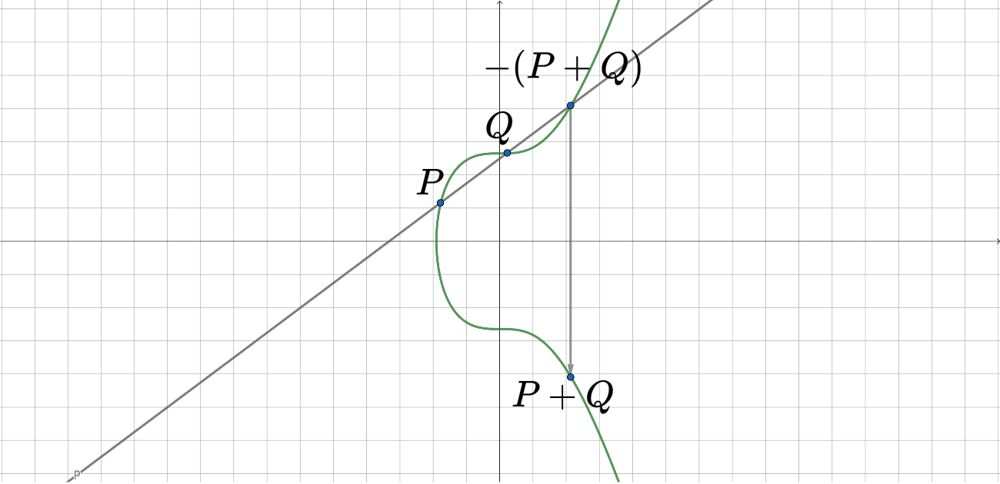
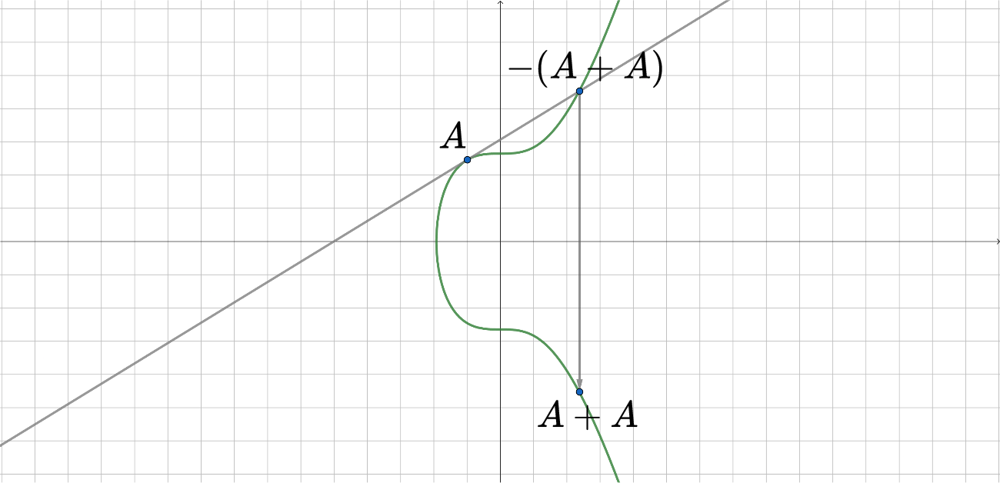
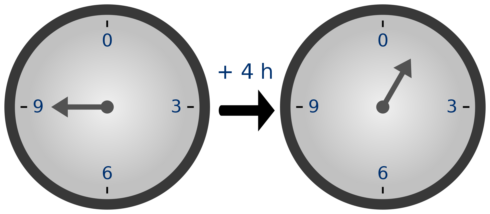
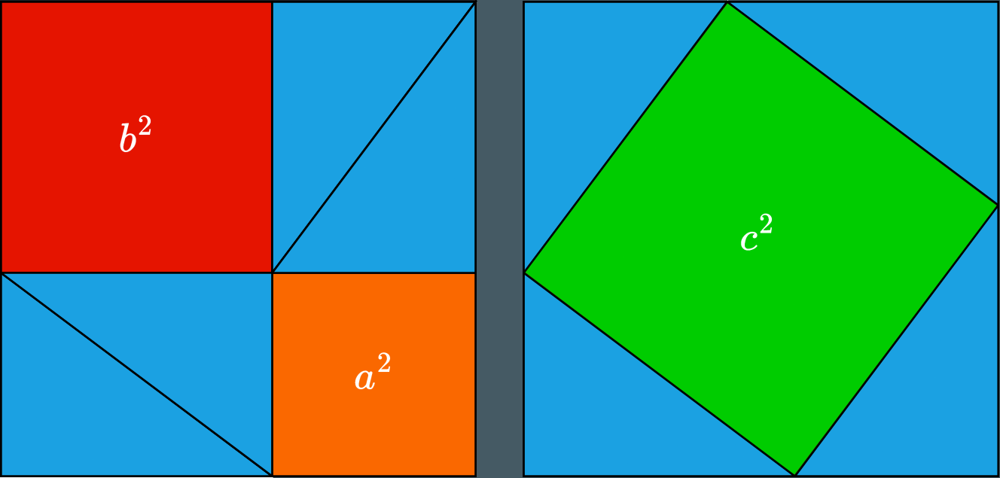

---

marp: true
class: invert
theme: gaia
math: mathjax

---

## Algebraic Geometry And Its Applications

Made by:

- Rizaev Daniil
- Khismatov Ruslan

---

## Algebraic Geometry

- Algebraic Geometry is a branch of mathematics which uses abstract algebraic techniques to solve geometric problems

---

## Elliptic Curves

- Elliptic curves are given by the family of equations:

 

$$ y^2 = x^3 + ax + b $$

 

---

## Graphs Of Elliptic Curves

---

## Point Addition

---

## Adding Point To Itself

---

## Modular Arithmetic

---

## Cryptography

Cryptography is the study of constructing and analyzing protocols that prevent third parties or the public from reading private messages.

---

<!-- ## Elliptic Curves in Cryptography -->
<!---->
<!-- Elliptic curves are used in cryptography as they provide an operation that is easy to do one way, but extremely difficult to reverse - addition of points on the curve. -->
<!---->
<!-- --- -->
<!---->

## Public Key Cryptography

Public Key Cryptogrphy deals with cryptographic systems that operate on pairs of public and private keys.

 

Usually private key contains some information about structure of public key that is otherwise very hard to determine without knowing the private key.

---

## Digital Signature

Digital Signature is a way of ensuring that message was signed with particular public/private key pair

---

## Hash Function

Hash Function is a function that given some message in binary gives back integer of fixed length called hash and satisfies a couple requirements:

- It should be difficult to find message that has given hash.
- If you have message and its hash it should be difficult to find another message with same hash
- It should be highly unlikely that two different messages have same hash

---

### Example Of A Hash

"Hello World" - a591a6d40bf420404a011733cfb7b190d62c65bf0bcda32b57b277d9ad9f146e
 
"Hello World!" - 7f83b1657ff1fc53b92dc18148a1d65dfc2d4b1fa3d677284addd200126d9069

---

## Elliptic Curve Digital Signature Algorithm

Elliptic Curve Digital Signature Algorithm (ECDSA) is an algorithm for signing messages with elliptic curves using addition of points on elliptic curves as its "one-way" function
 
---
## Parameters

Before using ECDSA all participants should agree on set of parameters.

- Specific curve to use
- Starting point 
- Group Order
- Finite Field (large prime)

---

<!-- - Curve -->
<!-- $y^2=x^3+7$ -->
<!-- - Starting Point  -->
<!-- $G=(x_g,y_g)$ -->
<!-- $x_g = \ 79BE667E \ F9DCBBAC \ 55A06295 \ CE870B07 \ 029BFCDB \ 2DCE28D9 \ 59F2815B \ 16F81798$  -->
<!-- $y_g = 483ADA77 \ 26A3C465 \ 5DA4FBFC \ 0E1108A8 \ FD17B448 \ A6855419 \ 9C47D08F \ FB10D4B8$ -->
<!-- - Group Order -->
<!-- $n=115\ 792\ 089\ 237\ 316\ 195\ 423\ 570\ 985\ 008 \ 687 \ 907 \ 852 \ 837 \ 564$ -->
<!-- $279 \ 074 \ 904 \ 382 \ 605 \ 163 \ 141 \ 518 \ 161 \ 494 \ 337$ -->
<!-- <!-- 78 digits --> -->
<!---->
<!-- --- -->

## Primitives

$d_A$ - private key - large integer

$Q_A = d_A * G$ - public point

$m$ - message or document to be signed, in binary

$z = HASH(m)$

---

## Signing Algorithm

- Generate secure random integer $k$ from $1$ to $n-1$
- Compute point $(x,y)=k*G$ 
- Compute $r=x \ \ mod \ n$
- Compute $s=k^{-1}(z + r*d_A) \ \ mod \ n$
  
Resulting pair $(r,s)$ is the signature

---

<!-- ## Elliptic Curves In Pure Math -->
<!---->
<!-- --- -->

## Pythagoras Theorem

Pythagoras Theorem states that if $a$ and $b$ are lengths of triangle legs and $c$ is length of its hypothenuse then

 

$$ a^2 + b^2 = c^2 $$

--- 

---

<!-- ### Example :   -->
<!---->
<!-- $$ 3^2 + 4^2 = 5^2 $$ -->
<!---->
<!-- --- -->

## Fermat's Last Theorem

Theorem states that there are no natural numbers a, b and c for which following would be true

 

$$ a^n + b^n = c^n , \ n \ge 3 $$

---

### Fermat wrote:

"I have discovered a truly marvelous proof of this, which this margin is too narrow to contain."

---

## Thank You For Watching!

