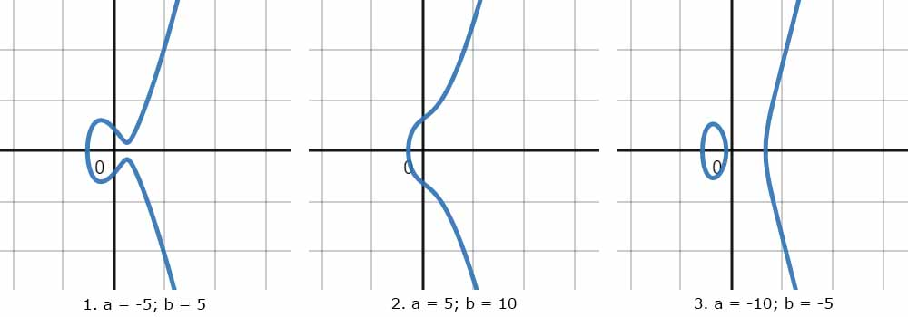

## Algebraic Geometry And Its Real World Uses

Made by:

-   Rizaev Daniil
-   Khismatov Ruslan

---

## Modular (Clock) Arithmetic

---

## Brief Intro To Elliptic Curves

$$ y^2 = x^3 + ax + b $$

Elliptic curves are given by this family of equations.

---

---

## Elliptic Curve Diffie-Hellman

---

## Thank You For Watching!

---
