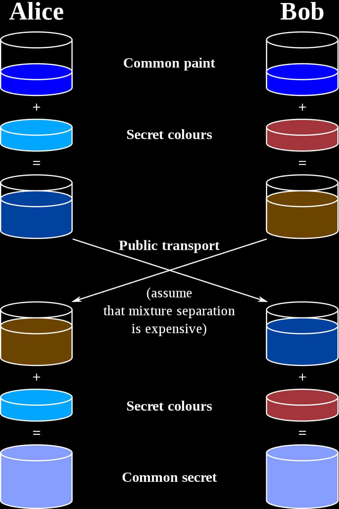
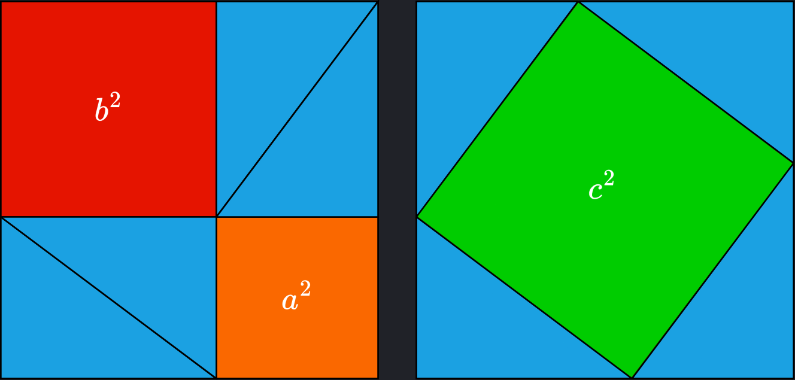

## Algebraic Geometry

Made by:

- Rizaev Daniil
- Khismatov Ruslan

---

## Algebraic Geometry

- Algebraic Geometry is a branch of mathematics which uses abstract algebraic techniques to solve geometric problems

---

## Elliptic Curves

- Elliptic curves are given by the family of equations:

 

$$ y^2 = x^3 + ax + b $$

 

---

## Graphs Of Elliptic Curves

---

## Point Addition

---

## Adding Point To Itself

---

## Cryptography

Cryptography is the study of constructing and analyzing protocols that prevent third parties or the public from reading private messages.

---

<!-- ## Diffie-Helman Key Exchange -->
<!---->
<!--  -->
<!---->
<!-- ---  -->

## Elliptic Curves in Cryptography

Elliptic curves are used in cryptography as they provide a "one-way" operation - addition of points on the curve.

---

## ECDSA

---

## Pythagoras Theorem

$$ a^2 + b^2 = c^2$$

 

---

### Example :  

$$ 3^2 + 4^2 = 5^2 $$

---

## Fermat's Last Theorem

Theorem states that there are no natural numbers a, b and c for which following would be true

 

$$ a^n + b^n = c^n , \ n \ge 3 $$

---

### Fermat wrote:

"I have discovered a truly marvelous proof of this, which this margin is too narrow to contain."

---

## Thank You For Watching!

---
