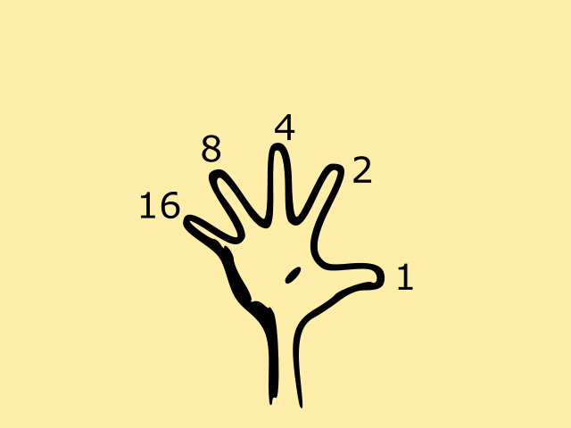

# Bunary Number System

Made by

- Rizaev Daniil
- Popov Alexander
- Aristova Maria
- Gafurov Aidar
- Demin Sergey
- Khafizov Bulat

---

## Real world uses

---

## Fun counting method

---

## Thank You For Watching !
