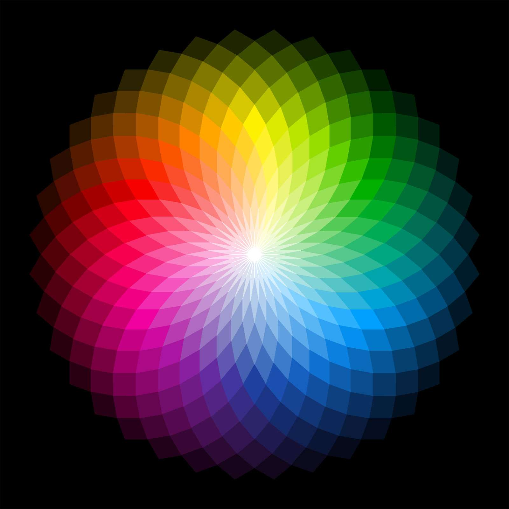

# Bunary Number System

Made by

- Rizaev Daniil
- Popov Alexander
- Aristova Maria
- Gafurov Aidar
- Demin Sergey
- Khafizov Bulat

---

## What is Binary number system

Binary - positional number system with 2 digits - 0 and 1

---

## History

 

---

## Big, Small And Negative

---

## Conversion

---

## Binary in computers

---

## 6. Real world uses

---

## Fun counting method

---

## Thank You For Watching !
