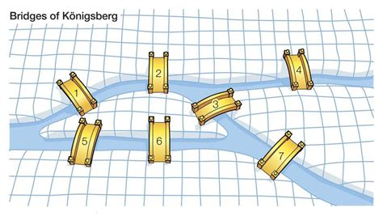
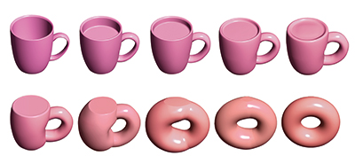
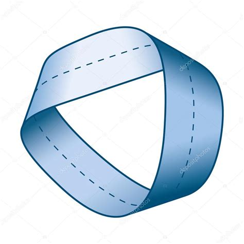
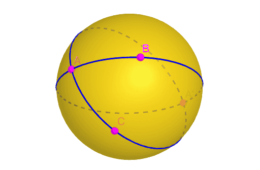

## Topology
By: Daniil Rizaev 05-305

---

## Defintion

Topology is a branch of mathematics concerned with geometric properties preserved under continuous deformation (stretching without tearing or gluing). 

---
## Seven Bridges of Königsberg

The city of Königsberg in Prussia (now Kaliningrad, Russia) was set on both sides of the Pregel River, and included two large islands—Kneiphof and Lomse—which were connected to each other, and to the two mainland portions of the city, by seven bridges. The problem was to devise a walk through the city that would cross each of those bridges once and only once.

---

## Bridges Of Konigsberg

---

## From Coffee Mug To Donut

---
## Möbius strip

---

## Antipodal Points

---

# Thank you for your attention !