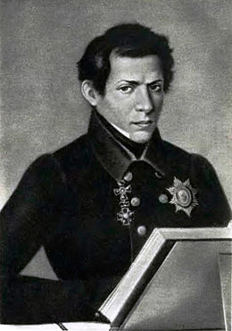
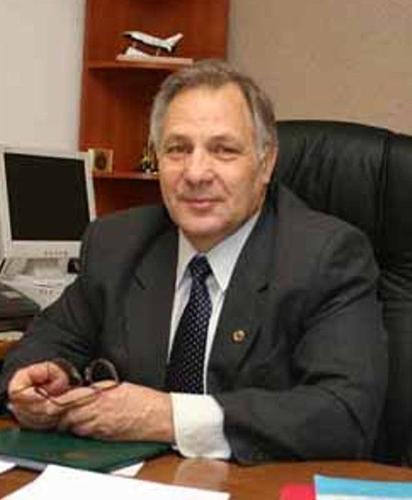
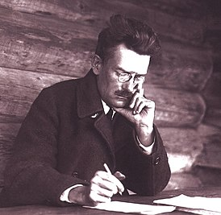
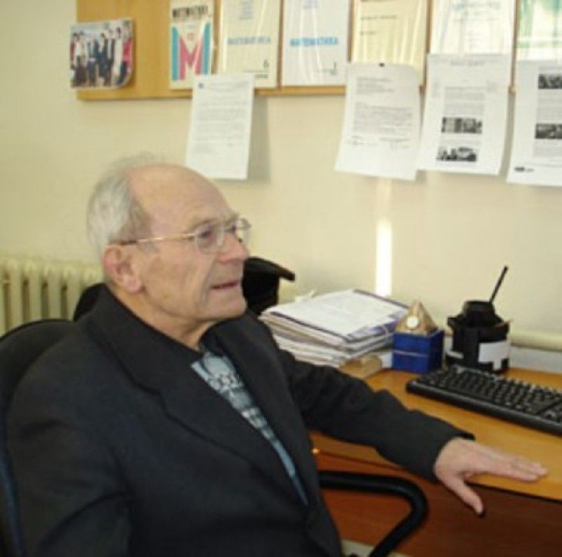

---

marp: true
theme: gaia
<!-- class: invert -->

---

# Outstanding Professors Of Kazan State University

Made By
 * Rizaev Daniil
 * Petrova Alisa
 * Shubin Dmitriy
 * Ovchinnikova Sofia
 * Nuriyeva Aylar

---

# Nikolai Lobachevsky

Nikolai Lobachevsky was an outstanding Russian mathematician who taught at Kazan University starting from 1807 and served as its rector from 1827 to 1846.

---

# Fomin Vasily Mikhailovich

Academician of the Russian Academy of Sciences, Doctor of Physical and Mathematical Sciences,
Director of the Institute of Theoretical and Applied Mechanics named after S.A.Khristianovich SB RAS

---

# Petr Alekseevich Shirokov

Soviet mathematician, Doctor of Physical and Mathematical Sciences in 1936, professor of Kazan State University in 1930. 

---

# Leonid Aleksandrovich Aksentiev

Leonid Aleksandrovich Aksentiev entered the Faculty of Physics and Mathematics of 
Kazan State University, from which he graduated with honors in 1954 with a degree in Mathematics

---

# Thank You For Your Attention !
